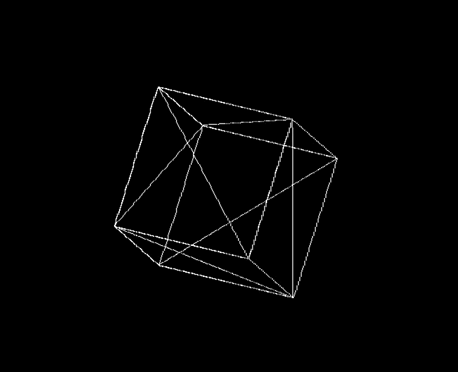

# Programming assignment 2
## 3D-viewer

**To run my program, enter `make` command in root path of this program and enter `./run` command to run this program.**

In this program, I made a 3d-viewer for parsed OBJ file and show its 3d model on the screen and this model has done the **normalization and located in the center of screen** when user opening it.

This program has two mode **Orthogonal mode(default)** and **Pespective mode**: press the `v` key to open Pespective mode and press it again back to Orthogonal mode

In each mode, you can :
+   press `r` key to enter the Rotation mode . In this mode, press `w` key and `s ` key to the rotation for x axis; press `a` and `d` key to do the rotation for y axis;
+   press `e` key to enter the Scale mode. In this mode, press `w` to scale up and press `s` to scale down.
+   press `t` key to enter the Translation mode. In this mode press `a` and `d` to move the 3D model left and right; press `w` and `s` to move the 3D model up and down

Specifically, this program has separate four part: Utility tools part; Obj file parse part; Drawing part and main part(assn2.cpp)
+   In Utility part:
    - Vector2f for **store two-dimensional data** 
    - Vector3f for **store three-dimentional data**
    - Matrix for **doing the calculation of Matrix**(matrix multiplication and matrix transpose)
+   Obj file parse part:
    - ObjLoader: **load and parse Obj file**, and separate infomation into vertex, norm, texture and its index(face). Storing these information to two-dimentional vectors.
+ Drawing part:
    - the code from assignment 1
    - Point for store x and y axis.
    - Shape(base class), Line, Triangle for drawing point, line and triangle
+ main part:
    - assn2: implement 3D model **viewing, rotation, translation and scale** by using the class mentioned above. In this part, I conver Vector2f and Vector3f to two-dimentional matrix(vetor) and three-dimentional matrix(vector) for calculation

 **Note that: In this project, I only use some basic OpenGL function.**

For chaning the OBJ file, go to assn2.cpp and change the value of `std::string path_name`(line 53).

In the folder of this project, I provide two obj file for testing ----` model1.obj and model2.obj`.

Orthogonal View: 

 
Perpective View: 

