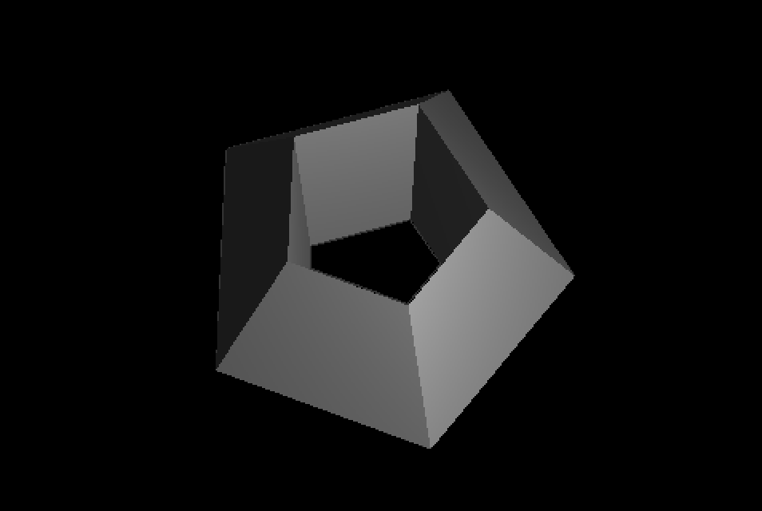
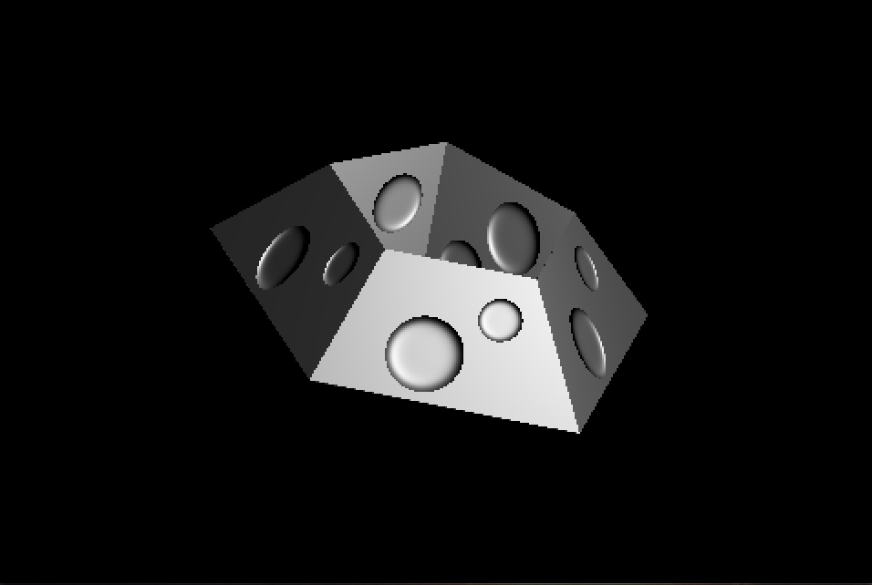

# Programming assignment 3
## Ray-tracer

**To run my program, enter `make` command in root path of this program and enter `./run` command to run this program.**

In this program, I implement `basic rendering`, `TRIANGLE REMESH` and `Bumpmapping`

Specifically for the class:

+  `Ray.*` to build a ray(which contain Rd and Ro)
+  `Illumination.*` is the class for recording every light parameter coef(ka,ks,kd)
+  `Ray_tracer.*` for doing the specific rendering of basic ray tracing , phong shading and bump mapping
	+ `Vector3f calBarycentry(const Ray&,const Triangle&);` for building the Barycentric coordinates
	+ `void findIntersection(bool);` for doing the ray-tracing rendering and bump mapping
+ In `Objloader.*`, line between(54 and 80), I implement the **triangle remesh** . Now this program can fit in any form of obj file for different format of `f` line and the vertical more than 3.

## Testing

+ When you runing the program, it will show the basic rendering(ray tracing)
+ For activate bump mapping: **press `b` key**
+ `model1.obj` and `model2.obj` is the example that professor given us.
+ For testing the vertex for a polygon that more than 3, please loading the `model3.obj`
	+ **The way to change obj file:** going to `assn3.cpp` and change `path_name`  (line 39) to `model3.obj`
+ Just like assignment 2:
	+ you can rotate the object by press `r` key, `w and s` for rotating to x axis and `a and d` for rotating y_axis
	+ `e` key for scaling; `w` for scaling up, `s` for scaling down
	+ `t` key for moving object `w`,`a`,`s`,`d` is up, left, down, right

## Result(Ray tracing)
The result shows (`Basic rendering`, `Bump mapping`) in the `./picture/` folder

### Basic Rendering

### Bump Mapping
