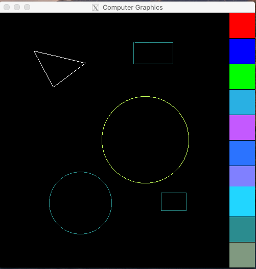

# Programming assignment 1

## Discribe

In this program assignment, I have drawed **Line**, **Rectangle**, **Triangle** by using dda algorithm. 

Specifically, I use the dda to draw a **line**. Then, I used dda function from line to draw **Triangle** and **Rectangle**.

Also, I use midpoint algorithm to draw **circle** and **Eillpse**.

I made all the shape mentioned above as a class, and those classes inherit the **Shape** class. 

I made a draw() funciton in the Shape class, their children will inherit this function.

When start a program, I made a Point vector to store the point I click before in the main function(assn1.cpp). What's more, each shape class except shape itself will also have a vector to store the click point.

When I click keyboard of  'r'-rectangle, 'c'-- circle, 'e' -- eillpse and t -- triangle, the program
will pass the point vector from main function to the shape class you choose. Then, the point vector in the main function will be clear.

Moreover, I made a vector to store all the shape class. In other words, it stores the shape I drawed before. In the display function, it will iterate this vector in order to draw all the shape I drawed.

For colorpicker, I make a specific area for different color. Choose this color by click the color area.
**Note that: In this project, I only use some basic OpenGL function.**

## Run

To run my program, you need to complie first, where enter the `make` command to complie.

Then, use `./assn1` to run my program

To draw a shape, you need to click the number of points on the window first. When the number of points meet the requirement for drawing the shape(for example three points for triangle), click the keyboard command mentioned(for triangle, it should be `t`) in the previous section. Then, the correspond shape should be show on screen. If you need to add a color, you need to click the color area and then click the number of points, press the keyboard command in the final.

short version for draw a shape in my program:
    choose a color -> click number of points -> press the keyboard
